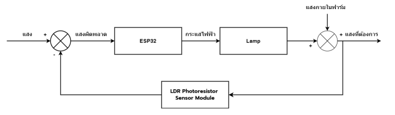

# SMARTHYDROPONIC
## Project for the 70th Arts and Crafts Competition, 2022

This project utilizes knowledge and experience gained from workshops and self-study, subsequently developing it into an academic skill project for the software category at the 2022 Arts and Crafts Competition.

### [Download Document and Content](โครงงาน-Smart-hydroponic.pdf) 📥

## Equipment

### Software Tools Used in the Project

#### Blynk
Used to create an IoT control system.

##### Examples

#### Thunkable
Used for creating specialized applications.

##### Examples

#### Arduino IDE
Used for developing code to control the microcontroller board.

### Hardware Components

#### ESP32

- The ESP32 is a microcontroller IC that supports WiFi and Bluetooth 4.2 BLE, manufactured by Espressif in China. Its price is under 500 THB (for a development board). The specifications include:
  - Dual-core Tensilica LX6 architecture CPU with a clock speed of 240 MHz
  - 512 KB of internal RAM
  - Supports external ROM connectivity up to 16 MB
  - WiFi standard 802.11 b/g/n with Station, softAP, and Wi-Fi direct modes
  - Integrated Bluetooth supporting 2.0 and 4.0 BLE modes
  - Operating voltage of 2.6V to 3V
  - Operating temperature range of -40°C to 125°C
- The ESP32 also includes various built-in sensors such as:
  - Noise filtering circuits in the signal amplification circuit
  - Magnetometer
  - Capacitive touch sensor supporting 10 channels
  - Supports a 32.768 kHz crystal for timing circuits
- GPIO features include:
  - 32 GPIO pins
  - Supports 3 UARTs, 3 SPIs, 2 I2Cs, 12 ADCs, 2 DACs, and 2 I2S interfaces
- The ESP32 offers high performance, with data transmission speeds of up to 150 Mbps in 11n HT40 mode.

#### DHT22 Temperature and Humidity Sensor

- The DHT22 module is a high-accuracy digital temperature and humidity sensor designed for better performance than the DHT11.
  - Humidity accuracy: ±2%RH (Max ±5%RH); Temperature accuracy: ±0.2°C
  - Humidity sensitivity: 0.1%RH; Temperature sensitivity: 0.1°C
  - Measurement interval: Average 2 seconds

#### E-201-C pH Sensor

- Used to measure the pH level of water. It comes with a probe and can measure a range of 0-14 pH with an output in analog form (0-1024 mA).
  - Operating voltage: 5.00V
  - Measuring temperature: 5 – 60 °C
  - Accuracy: ± 0.1pH at 25 °C

#### EC Sensor

- Used to measure the electrical conductivity of water solutions, applicable in smart farming, aquaculture, and hydroponics.
  - Working voltage: +5.00V
  - Measuring range: 1ms/cm–20ms/cm
  - Applicable temperature: 5-40 °C

### Smart Hydroponic System Design

### Smart Hydroponic Lighting Control System Design

### pH Control System Design

### Temperature and Humidity Display System Design

### Electrical Conductivity (EC) Display System Design

### Water Temperature Display System Design

